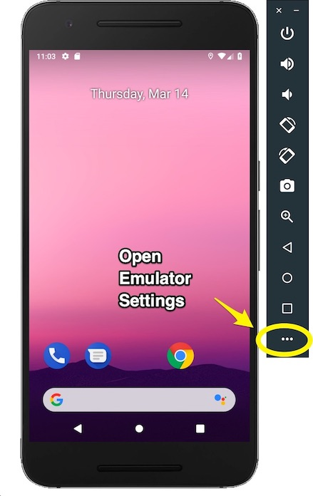
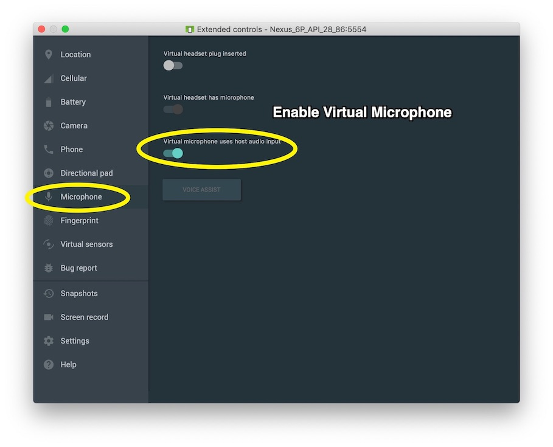

# 1903_SeymourBailey
### Installation instructions

Installing the release APK is the preferred method of installing the app by dragging it onto the Android Emulator or copying onto a physical device. 

### Hardware considerations and requirements

*For Milestone 2+/Chirp:*

For Chirp related functionality there are a few things that need to be enabled/checked to make sure speaker and microphone capabilities work correctly.

1. Ensure the device volume is loud (Using volume buttons on emulator or device)
2. Ensure the macOS volume is loud when using emulators as this is a separate control.
3. **Enable the "Virtual microphone uses host audio input" option in emulator settings. As receiving audio on an emulator is not enabled by default.** See *EnableMicrophone_01.jpeg* and *EnableMicrophone_02.jpeg* in the same folder as this README for examples on how to do this.
4. 
5. 
6. Also, if you are still having issues with the microphone on the emulator be sure to  double check the microphone privacy settings and input source on your computer in System Preferences as Apple has imposed further restrictions on microphone access in Mojave.

### Login requirements for testing

OverShare demo login:

Email/Username: `demo@example.com`

Password: `fullsail`

### List of known bugs

None currently.

### Special requirements and considerations for testing

Some areas of the app may have buttons that only show a Toast message indicating the functionality is scheduled for a future milestone (This is the intended functionality).